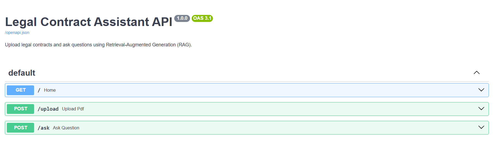
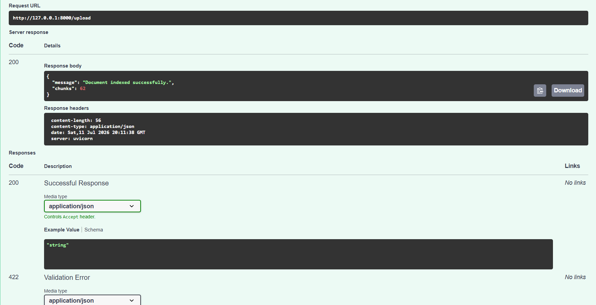
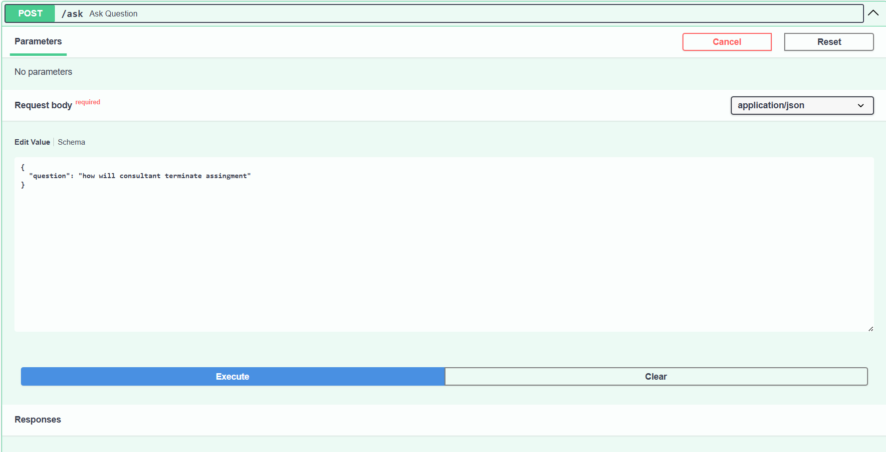
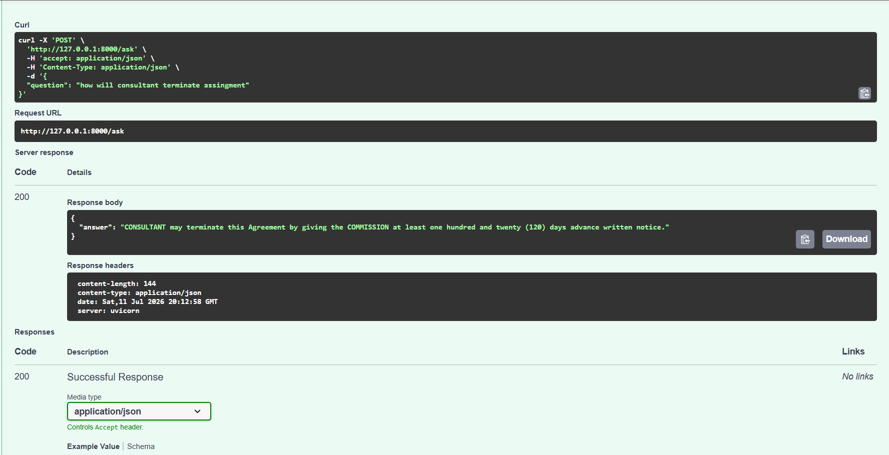

# 📄 Legal Contract Assistant

An AI-powered Legal Contract Assistant built using **FastAPI**, **Retrieval-Augmented Generation (RAG)**, **Sentence Transformers**, and **Google Gemini**. The application allows users to upload legal contract PDFs and ask natural language questions about their contents.

---

## 🚀 Features

- Upload legal contract PDFs
- Extract text from PDF documents
- Intelligent document chunking
- Semantic search using vector embeddings
- Retrieval-Augmented Generation (RAG)
- Natural language question answering using Google Gemini
- REST API built with FastAPI
- Interactive API documentation with Swagger UI

---

## 🛠️ Tech Stack

### Backend
- Python
- FastAPI
- Pydantic
- Uvicorn

### AI / NLP
- Sentence Transformers (`all-MiniLM-L6-v2`)
- Google Gemini API

### Document Processing
- pypdf
- pdfplumber

### Vector Search
- In-Memory Vector Store
- Cosine Similarity Search

### Testing
- Pytest

---

## 📂 Project Structure

```
backend/
│
├── app/
│   ├── api/
│   ├── chunking/
│   ├── embeddings/
│   ├── llm/
│   ├── parser/
│   ├── prompts/
│   ├── retriever/
│   ├── schemas/
│   ├── services/
│   ├── vectorstore/
│   └── main.py
│
├── tests/
├── requirements.txt
└── README.md
```

---

## ⚙️ How It Works

```
                Upload PDF
                     │
                     ▼
              PDF Text Extraction
                     │
                     ▼
              Section Chunking
                     │
                     ▼
        SentenceTransformer Embeddings
                     │
                     ▼
            In-Memory Vector Store
                     │
                     ▼
          Semantic Similarity Search
                     │
                     ▼
            Retrieved Context
                     │
                     ▼
        Prompt Builder + Gemini LLM
                     │
                     ▼
             Generated Answer
```

---

## 📌 API Endpoints

### Upload a Contract

```
POST /upload
```

Uploads a PDF, extracts text, generates embeddings, and stores them for retrieval.

---

### Ask Questions

```
POST /ask
```

Accepts a natural language question and returns an answer generated using retrieved document context.

Example:

```json
{
    "question": "What are the termination conditions?"
}
```

---

## 🧠 RAG Pipeline

1. Upload Contract PDF
2. Parse document
3. Split into meaningful chunks
4. Generate embeddings using Sentence Transformers
5. Store embeddings in vector store
6. Retrieve most relevant chunks
7. Build prompt
8. Generate answer using Google Gemini

---

## ▶️ Installation

Clone the repository

```bash
git clone https://github.com/<your-username>/Legal_Contract_Assistant.git
```

Navigate into the project

```bash
cd Legal_Contract_Assistant/backend
```

Create a virtual environment

```bash
python -m venv .venv
```

Activate it

### Windows

```bash
.venv\Scripts\activate
```

### Linux / macOS

```bash
source .venv/bin/activate
```

Install dependencies

```bash
pip install -r requirements.txt
```

---

## ▶️ Running the Application

```bash
uvicorn app.main:app --reload
```

Open Swagger UI

```
http://127.0.0.1:8000/docs
```

---

## 📖 Example Workflow

1. Start the FastAPI server.
2. Upload a legal contract PDF using `/upload`.
3. Ask questions through `/ask`.
4. Receive answers generated from the uploaded contract using RAG.

---

## 🔮 Future Improvements

- Replace In-Memory Vector Store with Pinecone or Qdrant
- Support multiple uploaded documents
- Add metadata filtering
- Source citations for generated answers
- Conversation memory
- Docker support
- Authentication & user management
- Cloud deployment

---

## 🤝 Contributing

Contributions, suggestions, and feedback are welcome.

Feel free to fork the repository and create a pull request.

---

## 📜 License

This project is intended for educational and learning purposes.

## Swagger UI



## Upload Endpoint



## Ask Endpoint



## Response


